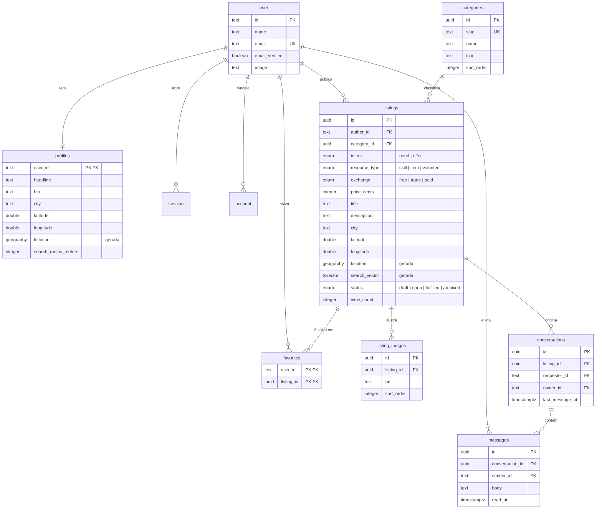

# Modelo de dados

Esquema definido em `src/db/schema/`, migrações versionadas em `drizzle/`.

## Diagrama



## Tabelas de autenticação

`user`, `session`, `account` e `verification` seguem o contrato do Better Auth. Os nomes dos
campos são ditados pela biblioteca e **não devem ser renomeados** sem ajustar o mapeamento em
`src/lib/auth.ts`.

O campo `account.issuer` costuma passar despercebido: é obrigatório a partir do Better Auth 1.7 e
guarda `"credential"` para contas de e-mail e senha, ou a URL do provedor para contas OAuth.

Os dados públicos do membro ficam em `profiles`, e não em `user`, justamente porque `user`
pertence à biblioteca e pode mudar entre versões. Separar protege o domínio de uma atualização.

## Colunas geradas

Três colunas nunca são escritas pela aplicação — o Postgres as calcula a cada gravação:

| Tabela | Coluna | Expressão |
| --- | --- | --- |
| `listings` | `location` | `ST_SetSRID(ST_MakePoint(longitude, latitude), 4326)::geography` |
| `listings` | `search_vector` | `to_tsvector('portuguese', title \|\| ' ' \|\| description \|\| ' ' \|\| city)` |
| `profiles` | `location` | igual ao de `listings` |

A alternativa seria manter as colunas manualmente — em gatilhos ou no código da aplicação. As duas
opções permitem dessincronizar: um `UPDATE` que esqueça o ponto deixaria o anúncio invisível para
a busca por raio, sem erro nenhum. Com coluna gerada isso é impossível por construção. Ver
[ADR-0011](./decisions/0011-colunas-geradas-para-geografia-e-busca.md).

Uma consequência prática: `latitude` e `longitude` são a fonte da verdade. Corrigir a posição de um
anúncio significa atualizar esses dois números; o ponto geográfico e o índice acompanham sozinhos.

## Índices

| Índice | Tipo | Serve a |
| --- | --- | --- |
| `listings_location_idx` | GiST | `ST_DWithin` — o filtro por raio |
| `listings_search_idx` | GIN | `search_vector @@ websearch_to_tsquery(...)` |
| `listings_status_created_idx` | B-tree | Listagem padrão: abertos, mais recentes primeiro |
| `listings_author_idx` | B-tree | Painel do membro |
| `listings_category_idx` | B-tree | Filtro por categoria |
| `profiles_location_idx` | GiST | Buscas centradas no perfil |
| `conversations_owner_idx` / `_requester_idx` | B-tree | Caixa de mensagens, por data |
| `messages_conversation_idx` | B-tree | Thread em ordem cronológica |

Que os índices espaciais e textuais são realmente usados dá para conferir:

```sql
EXPLAIN (COSTS OFF)
SELECT id FROM listings
WHERE ST_DWithin(location, ST_SetSRID(ST_MakePoint(-34.877, -8.0476), 4326)::geography, 25000);
--  Index Scan using listings_location_idx on listings
--    Index Cond: (location && _st_expand(...))
```

Em bases pequenas o planejador pode preferir uma varredura sequencial — ela é mais barata mesmo.
Use `SET enable_seqscan = off` para confirmar que o índice está disponível.

## Integridade

| Relação | Ao apagar o pai | Motivo |
| --- | --- | --- |
| `listings.author_id` → `user` | `CASCADE` | Apagar a conta remove o que ela publicou |
| `listings.category_id` → `categories` | `RESTRICT` | Uma categoria em uso não pode sumir e deixar anúncios órfãos |
| `listing_images.listing_id` → `listings` | `CASCADE` | Imagem não existe sem o anúncio |
| `favorites.*` | `CASCADE` | Vínculo puro |
| `conversations.listing_id` → `listings` | `CASCADE` | A conversa perde o objeto |
| `messages.conversation_id` → `conversations` | `CASCADE` | Mensagem não existe fora da conversa |

A restrição `conversations_listing_requester_key` garante **uma conversa por par (anúncio,
interessado)**. É ela que permite ao `startConversation` usar `ON CONFLICT DO UPDATE` e ser
idempotente: responder duas vezes ao mesmo anúncio continua a conversa em vez de criar outra.

## Dinheiro

`price_cents` é um inteiro em centavos, não um decimal ou ponto flutuante. Duas regras de
validação em `listingInputSchema` mantêm a coerência:

- `exchange = "paid"` exige `priceCents`;
- qualquer outro `exchange` **proíbe** `priceCents`.

Sem a segunda, um anúncio marcado como doação poderia carregar um valor que a interface não exibe
mas que fica gravado no banco.

## Migrações

```bash
pnpm db:generate   # compara o schema com o snapshot e escreve o SQL
pnpm db:migrate    # cria a extensão PostGIS e aplica o que falta
```

O SQL gerado fica em `drizzle/` e **deve ser revisado antes do commit** — em particular quando
envolve colunas geradas ou tipos do PostGIS, que o gerador nem sempre exprime como se espera.
